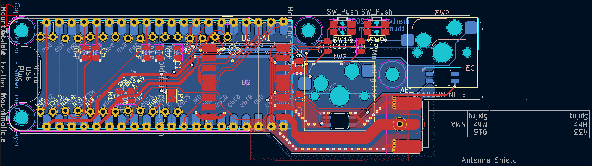

# pico-xpad
Raspberry Pi Pico Xinput focused Macropad / Gamepad

## Hardware
Folders in this repository have different hardware variations of the xpad.

### selectomatic-hw
Get you fingers ready to select as many buttons as DirectInput allows.

* 18 buttons (12 numbered keys + 4 directional keys + 2 special buttons)

### thumbs-down-hw
Pencils down folks; try out development ideas with this compact Pico + Feather Wing combo.



* dev kit for keys / usb / wireless with GP2040 FW or with CircuitPython 
* 4 buttons (2 keys + 2 special buttons)
* feather wing socket
** 4 more buttons w/ OLED display wing
* [RFM69HCW](https://www.adafruit.com/product/5692) module for 915/433Mhz wireless
** compact spring antenna (for [915](https://www.adafruit.com/product/4269)/[433](https://www.adafruit.com/product/4394)) or SMA connector
** footprint compatible w/ [RFM95CW](https://www.adafruit.com/product/5684) LoRA modules

## Firmware

The gamepad hardware supports running the GP2040-CE firmware out of the box.

### Compiling custom GP2040-CE firmware on MacOS

Steps to build the firmware on MacOS since this is not covered, but similar to, the steps provided in the project user guide for Linux.

```
brew update
brew install --cask gcc-arm-embedded
brew install cmake
brew install node@20
cd ~/repos
git clone https://github.com/OpenStickCommunity/GP2040-CE.git
git clone https://github.com/raspberrypi/pico-sdk.git --branch master
cd pico-sdk
git submodule update --init
cd ../
cd GP2040-CE
mkdir build
cd build
PICO_SDK_PATH=/Users/ihartwig/repos/pico-sdk cmake ..
PICO_SDK_PATH=/Users/ihartwig/repos/pico-sdk make
```

## Credits

Footprints reused from community designs:
* https://github.com/Kozova1/Macropad
* https://github.com/ebastler/kicad-keyboard-parts.pretty/
* https://datasheets.raspberrypi.com/rp2040/VGA-KiCAD.zip
* https://datasheets.raspberrypi.com/rp2040/VGA-PicoW-KiCAD.zip
